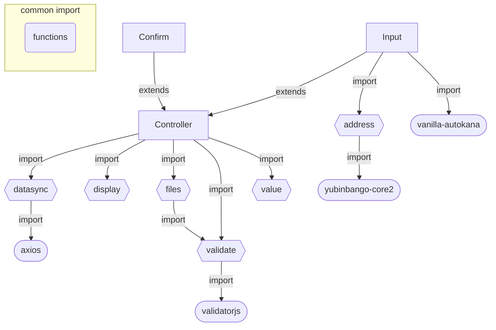

# フォーム

## 未実装機能
* セッション機能  
    JS SessionStorage で仮作成  
    DinamoDBでの管理を想定
* 画像送信機能  
    S3にPOSTすることでDynamoDBなどの疎通を軽減
* 送信先未指定

## 動作確認
* [テスト用フォーム](./test/index.html)

## Structure(構造)
```
form/
    ├ core/controller.js ⇒ input.js, confirm.js の親クラス
    ├ modules/
    │       ├ address.js => 郵便番号からの住所入力
    │       ├ datasync.js => データの非同期処理
    │       ├ display.js => 表示切替やスクロールなどフロントエンド処理
    │       ├ files.js => フォーム内の添付ファイルに関する処理
    │       ├ functions.js ⇒ 汎用的な関数群を定義し静的に呼び出す
    │       ├ validate.js ⇒ vanillaJSライブラリvalidatorjs を利用したクラスでvalidate処理
    │       └ value.js ⇒ フォーム値に関する処理
    │
    ├ confirm.js ⇒ 確認画面で利用するクラス
    └ input.js ⇒ 入力画面で利用するクラス

node_modules/
    ├ axios => 疎通用
    ├ validatorjs => 単体では機能しないvalidate機能、validate.jsで機能拡張
    ├ vanilla-autokana => 名前入力とカナ入力を紐づける
    └ yubinbango-core2 => yubinbango.js の代替品、address.jsで機能拡張
```

## Dependency(依存)


## How to use

### config.json を準備
フォーム内のvalidation や送信値に関する項目を定義する

* 基本形[rules, messages]  
validationに関するrule及びinvalid 時のmessageを定義  
フォーム上で入力項目として利用する場合必須  
```
    "i_mail": {
        "rules": [ "max:50", "email" ],
        "messages": { 
            "max": "メールアドレスは50文字以内で入力してください", 
            "email": "メールアドレスの形式で入力してください" 
        }
    },
```

* オプション[autokana, mixed, exclude]
    * autokana ⇒ to に設定したid値を持つinputにカナ自動入力  
    外部ライブラリvanilla-autokanaのオプションを参照
    * mixed ⇒ フォーム入力値を文字列として結合する
        * mix ⇒ 対象のnameを配列で定義
        * join ⇒ 対象文字列の結合に用いる文字を定義
    * exclude ⇒ 入力項目にあるがフォーム送信時に含めない項目を設定する  
    例)i_last_name, i_first_name をi_full_nameへまとめて送信するため入力値は不要
```
    "i_last_name": {
        "autokana": { "to": "i_last_kana", "katakana": true },
        "exclude": true
    },
    "i_first_name": {
        "autokana": { "to": "i_first_kana", "katakana": true },
        "exclude": true
    },
    "i_full_name": {
        "mixed": {
            "mix": ["i_last_name", "i_first_name"],
            "join": "　"
        }
    },
    "i_last_kana": {
        "exclude": true
    },
    "i_first_kana": {
        "exclude": true
    },
    "i_full_kana": {
        "mixed": {
            "mix": ["i_last_kana", "i_first_kana"],
            "join": "　"
        }
    },
```

* オプション[fixed]  
フォームの操作に関わらず送信時に使用する固定値を設定
```
    "i_form": {
        "value": "TestForm",
        "fixed": true 
    },
```

* オプション[join]  
    * join ⇒ checkbox, select は複数選択可能な配列として取得する  
    true もしくは文字列を設定することでフォーム送信時には文字列へ変換し送信を行う
```
    "i_pref": {
        "rules": [ { "in": [
            "北海道", "青森県", "岩手県", "宮城県", "秋田県", "山形県", "福島県", "茨城県", "栃木県", "群馬県", "埼玉県", "千葉県" ,
            "東京都", "神奈川県", "新潟県", "富山県", "石川県", "福井県", "山梨県", "長野県", "岐阜県", "静岡県", "愛知県", "三重県" ,
            "滋賀県", "京都府", "大阪府", "兵庫県", "奈良県", "和歌山県", "鳥取県", "島根県", "岡山県", "広島県", "山口県", "徳島県" ,
            "香川県", "愛媛県", "高知県", "福岡県", "佐賀県", "長崎県", "熊本県", "大分県", "宮崎県", "鹿児島県", "沖縄県"
        ]}],
        "messages": { "required": "都道府県を選択して下さい" },
        "join": true
    },
```

### クラスを初期化
* 入力項目のあるページで利用  
./test/src/js/index.js 参照

* 確認画面ページで利用  
./test/src/js/confirm.js 参照  
※入力と確認画面が混在しているページではInputクラスと共存可能

## debug
特定パラメーターを取得する関数を設定しているため、必要に応じてdebugを仕込むことが可能です

### FileReaderを利用した画像読込の非同期処理インターバル検証
* param
    * key: debug_changeFiles
    * value: {int} XXXX(ms)
    * url: https://example.com/form-test/?debug_changeFiles=2000
* 『読込開始～終了までの処理中』にのみ発生させる動作の確認に利用
    1. 読込中は送信ボタンを押せないようにする
    2. 読込中のエフェクトなどDOM操作に関する挙動を確認

### フォーム入力画面での送信検証
* param
    * key: debug_submit
    * value: {boolean} 1
    * url: https://example.com/form-test/?debug_submit=1
* フォームを送信せずに値の検証などを行う場合に利用
    1. フォームから取得した入力値が意図したものになっているか
    2. API2種(S3,Session)の検証
